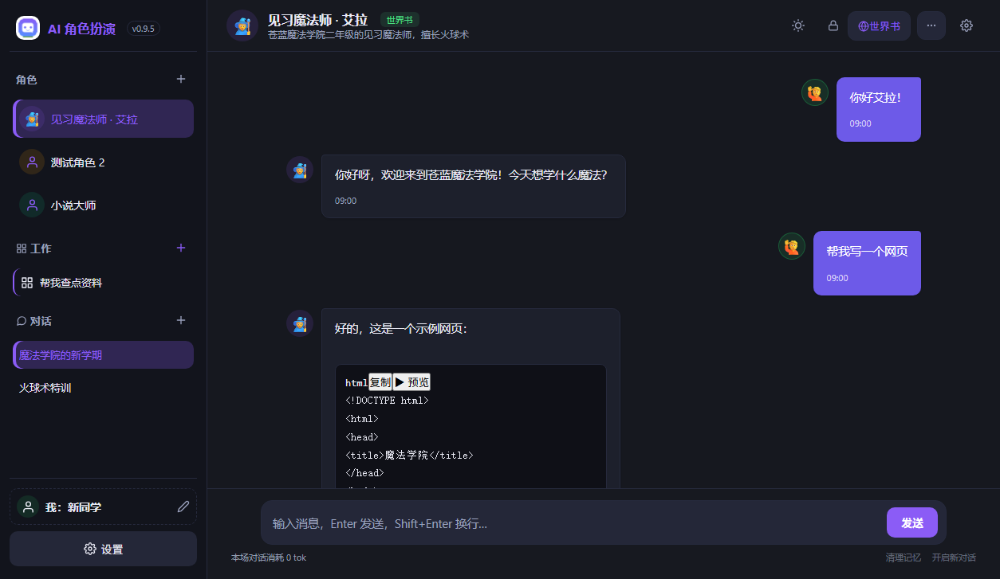
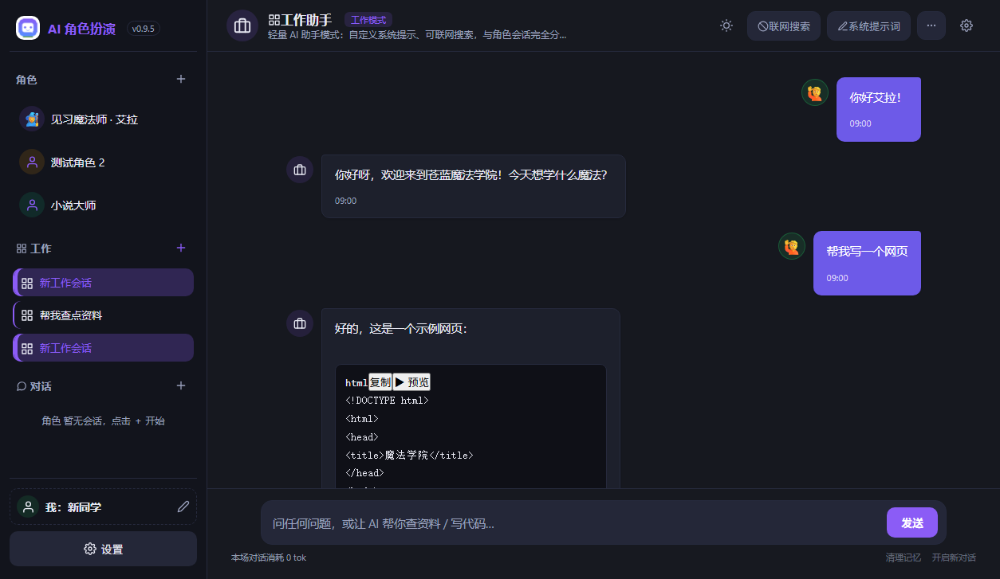
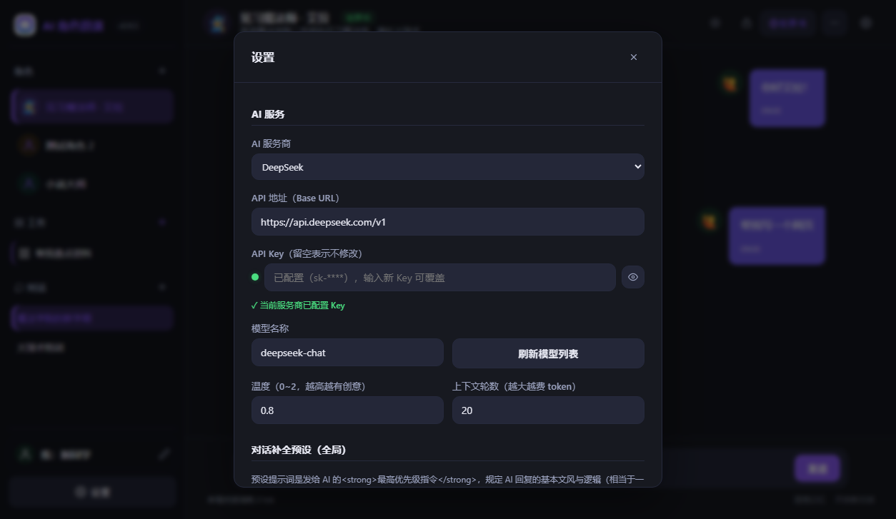

# RoleplayChat — AI 角色扮演工作室

**免浏览器、免配置的 Windows 桌面 AI 角色扮演应用 · 兼容 SillyTavern · 支持工作模式**

> ⬇️ 下载请前往右侧 **Releases** 页面（或下方下载按钮）。

## 这是什么

RoleplayChat 是一款轻量级 Windows 原生桌面应用，用于沉浸式 AI 角色扮演与文字冒险。自带任意 OpenAI 兼容 API Key（DeepSeek、OpenAI、Kimi、通义千问、智谱 GLM、Ollama 本地…），创建角色、导入 SillyTavern 世界书与角色卡即可开玩。

**技术栈**：Go（Wails v2）+ Angular + SQLite · **当前版本**：v0.10.4

## 截图

| 深色聊天 | 工作模式 | 设置 |
|---|---|---|
|  |  |  |

## 安装

从 **Releases** 页面下载最新版本：

- **`roleplay-chat-amd64-installer.exe`** —— NSIS 安装包（**推荐**，双击安装，必要时自动安装 WebView2 运行库）

> 仅提供安装版。数据保存在系统目录（`C:\ProgramData\RoleplayChat`），卸载时保留。

## 快速开始

1. 下载并安装应用。
2. 打开 **设置** → 填入 **API 地址 / Key / 模型**（任意 OpenAI 兼容服务商：DeepSeek、OpenAI、Kimi、通义千问、智谱、Ollama 本地 `http://localhost:11434/v1` 等）。
3. 创建或导入一个角色（或新建工作会话），发一条消息即可。

## 主要功能

- **角色**：自定义人设 / 系统提示词 / 开场白；SillyTavern 角色卡 V2/V3 导入导出（JSON / PNG）；头像（emoji 或本地图片）。
- **世界书**：分组分类、8 种插入位置、常驻 / 关键词 / 正则 / 可选过滤触发、完整 SillyTavern 字段映射。
- **预设兼容**：直接导入 SillyTavern 预设（TGbreak、夏瑾等），支持其中的正则脚本引擎与变量系统（{{setvar::}} / {{getvar::}} / {{random::}}），可逐个开关脚本。
- **流式输出**：打字机逐字渲染、停止与重新生成、实时思考链展示。
- **记忆系统**：AI 维护结构化记忆表格，长对话自动压缩为剧情摘要，本地消息永不被删除。
- **工作模式**：AI 工作助手会话，独立于角色模式；联网搜索、自定义系统提示词、会话导出。
- **界面**：深色/浅色主题、角色头像、三语言（简体中文 / English / Русский）。

## 常见问题

- **360 报毒（HEUR/QVM202...）怎么办？** 这是误报——见 [FAQ：360 报毒说明](FAQS_360_FALSE_POSITIVE.md)。一句话：软件完全开源，代码全部公开，安装包未签名 + NSIS 安装器特性容易被启发式引擎误判；按 FAQ 在 360 里添加信任即可，或提交官方申诉（fuwu.360.cn/shensu）。

- **API Key 存在哪里？** 配置文件位于 `C:\ProgramData\RoleplayChat\config.json`，Key 使用 Windows DPAPI 加密存储（绑定当前系统账号），卸载后数据默认保留。
- **如何更新？** 到 Releases 页面下载新版本安装包，覆盖安装即可，聊天记录与设置自动保留。

## 许可

MIT License —— 允许个人及商业使用。你的数据始终留在你的机器上。
